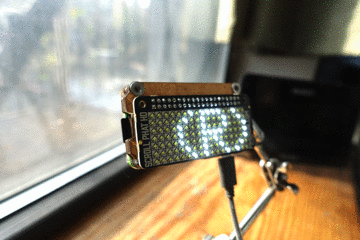

# mta-leavenow
A python script that let’s you know when it’s time to leave home to make the next subway train. The script reads the NYC MTA data feed to determine the next arrival train for a given station.

The script has been completely re-written and now uses Andrew Dickinson's NYCT-GTFS library.

# Output
Output is the console but its intent is to output to some sort of display. I have it running on a Raspberry Pi Zero W with a [Scroll pHAT HD](https://shop.pimoroni.com/products/scroll-phat-hd). I've then mounted it on a wall next to the door so I can glance at it just before I leave the apartment.



Typical output:
```The (D) train departs in 8 min then (N) train departs in 11 min.```

# Prerequisites
The following packages are needed:  Andrew Dickinson's [NYCT-GTFS] library (https://github.com/Andrew-Dickinson/nyct-gtfs). Depending on your system, you can install it with something like:
```
pip install nyct-gtfs
```

You’ll also need an MTA API key that you can register for here: https://api.mta.info/#/AccessKey.

Finally you’ll need to know the feed URL and stop ID for the train and station you want to monitor. See https://api.mta.info/#/subwayRealTimeFeeds and http://web.mta.info/developers/data/nyct/subway/Stations.csv for those.

# Installation and Configuration

With git installed, you can do the following to get it on your system. I personally prefer to put everything into ***/usr/local/src*** but sitting in your home directory will do.
```
git clone https://github.com/rob718/mta-leavenow.git
```
Once installed, you’ll need to edit the script to add things like an API key, feed IDs, and some other stuff.
```
cd mta-leavenow
nano mta-leavenow.py
```
**my_api_key** - Update the API key your key that you registered for here: https://api.mta.info/#/AccessKey

**my_stop_id** - The station you want to monitor. Determine "GTFS Stop ID" and suffix with direction (i.e. N or S). For example 'R31N' will monitor north-bound trains at Atlantic-Barclays Center. Complete station list here: http://web.mta.info/developers/data/nyct/subway/Stations.csv

**my_walking_time** - Specify the amount of time (in minutes) it takes to walk to the station. This makes sure that only trains you can actually make will be shown.

**Subway Feed ID** - Specify the feed ID from the list of feeds here http://datamine.mta.info/list-of-feeds. For example 16 is the R, N, W, Q line. If you want to monitor multiple lines, comma separate them e.g. ```[16,21]```.

**feed_refresh_delay** - Specify the refresh feed time. Feeds are generated every 30 seconds, so anything less wouldn't make sense.

# Data Usage
Feed size can be around 500 kiB. Therefore expect to pull around 350 MiB in a 24 hour period. Be warned!

# Execution
If you’re looking to run the script on boot, the simplest way would be to put it in the ***rc.local*** file. For example:
```
/usr/bin/python /usr/local/src/mta-leavenow/mta-leavenow.py &
```
However while testing it, I prefered to run it under screen, pressing ***CTRL-A***, then ***D*** to detach the current screen and logout. When I wanted to check progress, I simply entered ***screen -r*** to resume. For more information about screen, see: https://www.gnu.org/software/screen/manual/screen.html.
```
screen
cd mta-leavenow
python ./mta-leavenow.py
```
Also check out https://www.raspberrypi-spy.co.uk/2015/10/how-to-autorun-a-python-script-on-boot-using-systemd/

# Background
I don’t know about you, but I always run down those subway steps thinking I’ll miss the train if I don’t. One day I’m gunna fall. Seriously. How about a Raspberry Pi Zero connected to a set of LEDs counting down to the next subway train? Better yet, how about a scrolling display telling you when it’s time to leave home? Yes, that’s what I thought! I built this script to provide me (and maybe you!) stress-free travel to the local MTA station.

# Acknowledgments
First written in 2017 based on a concept by Anthony N http://github.com/neoterix/nyc-mta-arrival-notify. Re-written in 2022 using Andrew Dickinson's NYCT-GTFS library https://github.com/Andrew-Dickinson/nyct-gtfs. Thank you both!
